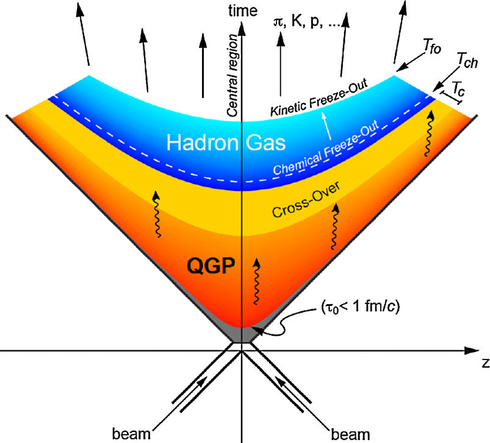

<!-- [PDF](http://127.0.0.1:4000/assets/pdf/JWALIT_Introduction_to_HRG_and_its_applications_Report.pdf)  [Slides](http://127.0.0.1:4000/assets/pdf/JWALIT_Introduction_to_HRG_and_its_applications_PPT.pdf) -->

<button type="button"> <a href='http://127.0.0.1:4000/assets/pdf/JWALIT_Introduction_to_HRG_and_its_applications_Report.pdf'> PDF </a> </button>        <button type="button"> <a href='http://127.0.0.1:4000/assets/pdf/JWALIT_Introduction_to_HRG_and_its_applications_PPT.pdf'> Slides </a> </button>

How did the universe look just a millionth of second after the big-bang? Was it like the hadronic-matter, that we see around us today? Or did a more disintegrated form of matter exist then, at that temperature and pressure? What existed then? So, what is understood is that at very high temperatures (of the order of 10^13 K, i.e., 160 MeV) and baryonic density, hadronic matter disintegrated into what is called Quark-Gluon Plasma (QGP). The conditions for this matter to exist are so extreme that untill recently it existed only in two places: 1) after the big-bang and 2) in the core of neutron-stars. In the QGP one cannot find hadrons, i.e., baryons (like protons, neutrons, etc) and mesons (pions, kaons, etc).

Today, in state-of-the-art accelerators like LHC and RHIC, nuclei are collided at unpercedented energies; about 5.0 TeV center-of-mass-energy per nucleon-pair at the CERN LHC and a couple of hundreds of GeV at the BNL RHIC. With these energies, it is possible to probe this exotic form of matter. Majorely, three collisions are done nucleus-nucleus (A-A), nucleus-proton (A-p) and proton-proton (p-p) at these facilities.

<figure>

<!--  -->

<figcaption>A Minkowski-space diagram of evolution of QGP after high-energy heavy-ion collision. Image courtesy- <a href='https://doi.org/10.1016/j.nuclphysa.2019.02.006'> Loosely-bound objects produced in nuclear collisions at the LHC </a> </figcaption>

</figure>

Above image shows the space-time diagram of two ion-beams colliding. The collision-event is marked by the origin of this 2-D figure. After it, the system expands. The QGP is marked in the diagram. This QGP state cools and expands futher, crossing over to a state called Hadron Resonance Gas (HRG). It goes through a chemical freeze-out point, where the quarks coalesce to form baryons and mesons. The hadron-ratios are fixed at chemical freeze-out temperature, and all non-elastic collisions cease after this. These hadrons constitute the HRG. Then a kinetic freeze-out point is reached, and all elastic-collisions cease after this point. Thence, momental of all particles are fixed, and they are registered in dectectors of ALICE, etc.